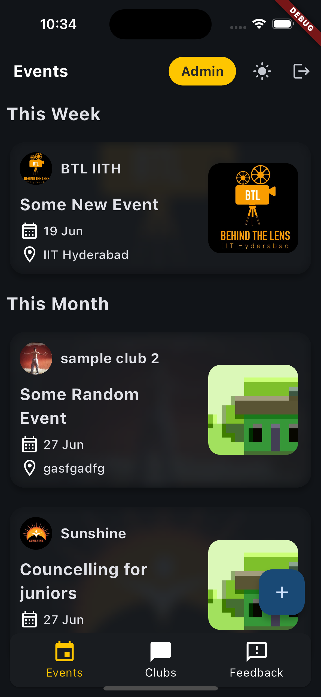
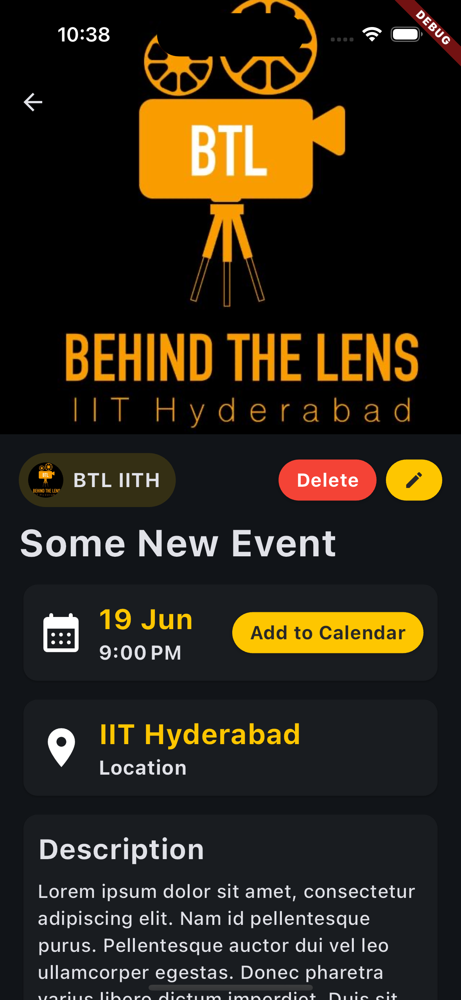
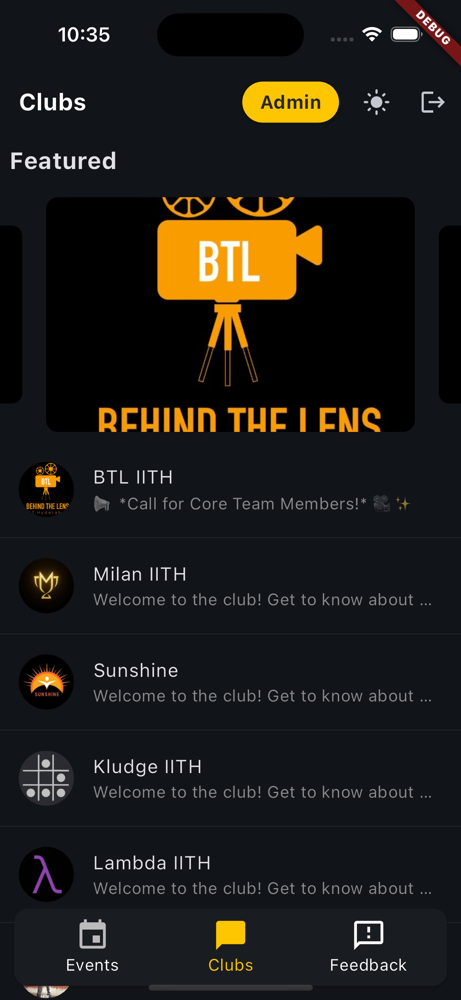
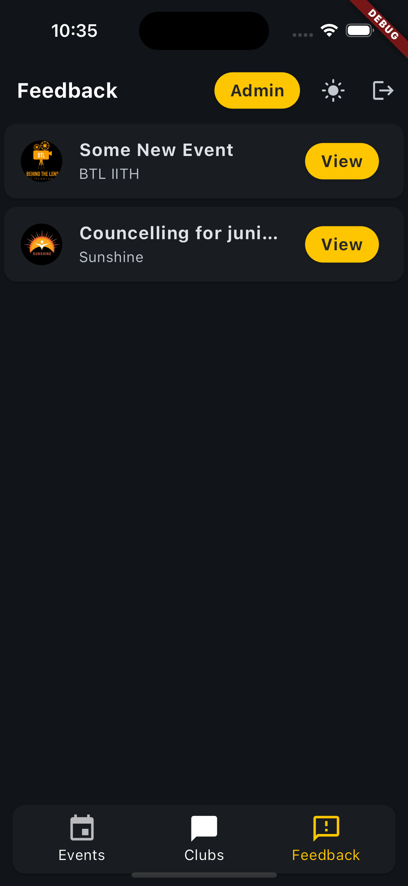
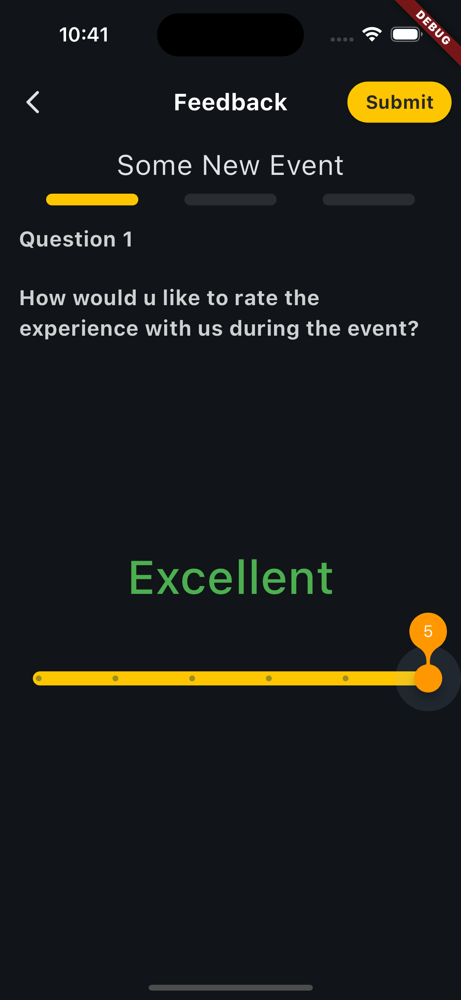
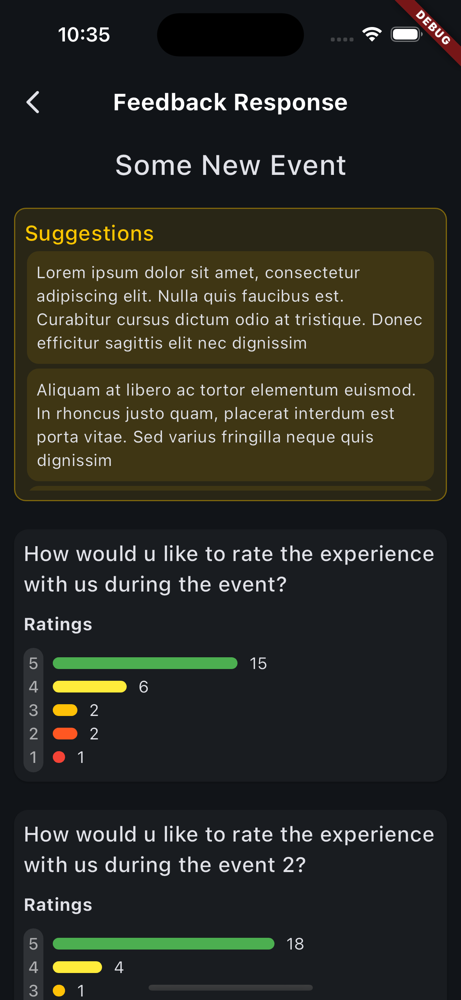
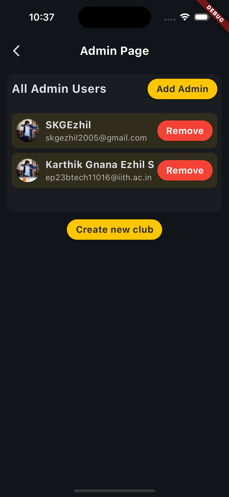
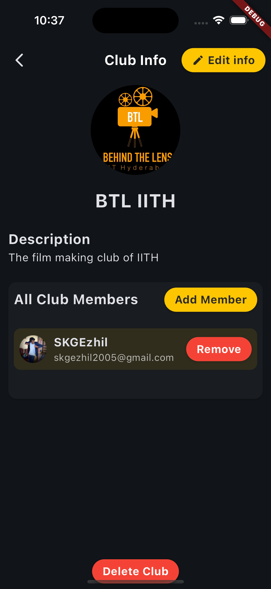
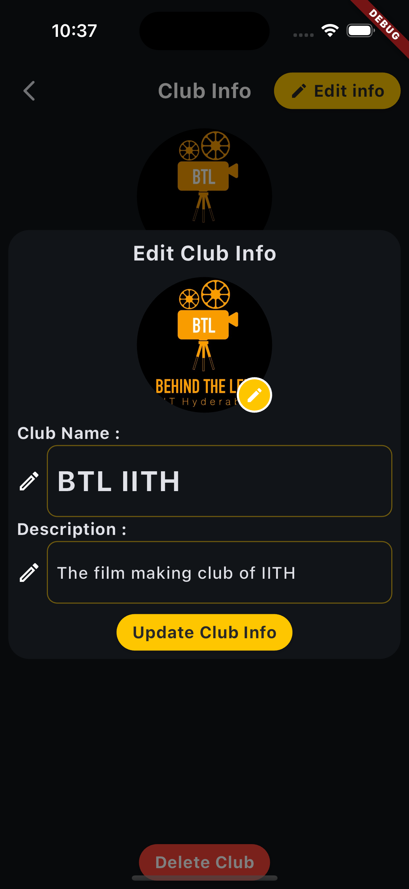

# Club Event Management App

This is a club event management application developed using Dart and Flutter. The application allows club members and admins to post about upcoming events. Other users can view these events and see posts on the respective club's page.

## Screenshots
<table>
  <tr>
    <td></td>
    <td></td>
    <td></td>
    <td></td>
   <td></td>
  </tr>
  <tr>
   <td></td>
    <td></td>
    <td></td>
    <td></td>
   <td></td>

  </tr>
</table>


## Features

1. **Post Operations**: Users can create a new post, can edit the post later and can also delete it forever. They can add text content and also attach an image from their gallery. The text content supports special characters as well.

2. **Event Operations**: Users can create a new event, can edit the event later and can also delete it forever. They can add an event name, description, date, time, and also attach banner image for events. Users can also add those events to their calendar

3. **Club Operations**: Users can create a new club, can modify club details later and can also delete it forever. They can add a club name, description, and also attach an image for display picture.

4. **Feedback System**: Users can create feedback forms for events and end users can submit their feedback.

5. **Admin Functionalities**: There are some specific widgets and tasks that can be accessed only by admins.

6. **Theme Support**: The application supports both light and dark themes. The theme colors are dynamically applied based on the current theme setting of the user's device.

7. **Error Handling**: Error handling is done at its best so that the app will display a snackbar of what occurred from the client side or server side


## User Roles and Permissions

### Basic Rights

| Role        | View Events/Posts |    Create Events    | Edit/Delete Events  |    Create Posts     |  Edit/Delete Posts  | Give Feedback |
|-------------|:-----------------:|:-------------------:|:-------------------:|:-------------------:|:-------------------:|:-------------:|
| User        |         ✅         |          ⬜          |          ⬜          |          ⬜          |          ⬜          |       ✅       |
| Club Member |         ✅         | ✅ (their club only) | ✅ (their club only) | ✅ (their club only) | ✅ (their club only) |       ✅       |
| Admin       |         ✅         |    ✅ (all clubs)    |    ✅ (all clubs)    |    ✅ (all clubs)    |    ✅ (all clubs)    |       ✅       |

### Advanced Rights

| Role        | Add/Remove Members from Club | Add/Remove members from Admin | Create Clubs | Edit/Delete Clubs | Create Feedback Forms | View Feedback Responses |
|-------------|:----------------------------:|:-----------------------------:|:------------:|:-----------------:|:---------------------:|:-----------------------:|
| User        |              ⬜               |               ⬜               |      ⬜       |         ⬜         |           ⬜           |            ⬜            |
| Club Member |              ✅               |               ⬜               |      ⬜       |         ⬜         |  ✅ (their club only)  |   ✅ (their club only)   |
| Admin       |              ✅               |               ✅               |      ✅       |         ✅         |     ✅ (all clubs)     |      ✅ (all clubs)      |


## Setup and Local Development

Follow these steps to setup and run the application locally:

1. **Clone the Repository**: First, clone the repository to your local machine using the following command:

    ```bash
    git clone https://github.com/SKGEzhil/club-app-flutter.git
    ```

2. **Install Flutter**: If you haven't already, install Flutter on your machine. You can follow the instructions provided in the official Flutter installation guide.  
3. **Get Dependencies**: Navigate to the project directory in your terminal and run the following command to get the necessary dependencies:
    
    ```bash
    flutter pub get
    ```

4. **Run the Application**: Finally, run the application using the following command:

    ```bash
    flutter run
    ```

## Configuration

Before running the application, you need to make a few updates:

1. **Update Endpoint URL**: Open the `config/constants.dart` file and update the `endPoint` with the URL of your backend server.

    ```dart
    const endPoint = 'http://10.0.2.2:4000';
    ```
   
2. **Update AWS Secrets**: The application uses AWS S3 for image storage. You need to update the AWS secrets in the `lib/utils/network_services/image_service.dart` file.

    ```dart
    final credentials = AwsClientCredentials(accessKey: AWS_ACCESS_KEY, secretKey: AWS_SECRET_KEY);
    ```
